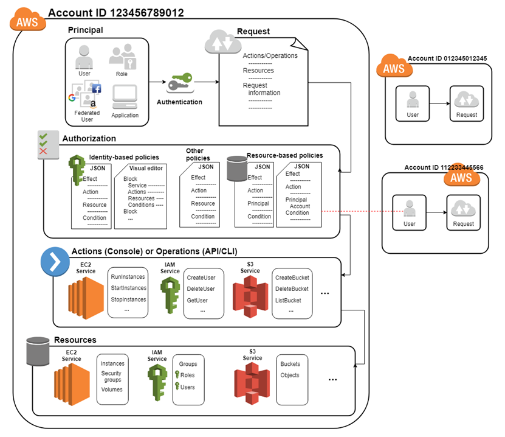

# Khái niệm
- AWS Identiry and Access Management (IAM) là một web service giúp bạn kiểm soát truy cập vào các dịch vụ trên AWS. Nó được sử dụng để điều khiển việc ai có thể truy cập và có quyền gì tới các resource.
- Tính năng:
  - ```Share access to your AWS account```: Cấp quyên sử dụng tài nguyên trong aws account của bạn mà không cần chia sẻ password or access key.
  - ```Granular permissions```: Cấp quyền khác nhau cho các user khác nhau với các resource khác nhau. For example, allow user access to EC2, S3, DynamoDB and another user read-only access just some S3 bucket,..
  - ```Secure access to AWS resources for applications that run on Amazon EC2```: You can use IAM features to securely provide credentials for applications that run on EC2 instances. These credentials provide permissions for your application to access other AWS resources
  - ```Multi-factor authentication (MFA)```: sử dụng phần mềm thứ 3 để tăng độ bảo mật 2 lớp.
  - ```Identitr federation```: You can allow users who already have passwords elsewhere—for example, in your corporate network or with an internet identity provider—to get temporary access to your AWS account.
  - ```Identity information for assurance```: If you use AWS CloudTrail, you receive log records that include information about those who made requests for resources in your account. That information is based on IAM identities.
  - ```PCI DSS Compliance```:
  - ```Integrated with many AWS services```:
  - ```Eventually Consistent```:
  - ```Free to use```:
- Accessing IAM:
  - AWS management console:
  - AWS Command Line Tools:
  - AWS SDKs:
  - IAM HTTPS API:

**How IAM works**
  
  - *TERM*:
    - ```IAM Resources```: The user, group, role, policy, and identity provider objects that are stored in IAM. As with other AWS services, you can add, edit, and remove resources from IAM.

    - ```IAM Identities```: The IAM resource objects that are used to identify and group. You can attach a policy to an IAM identity. These include users, groups, and roles.

    - ```IAM Entities```: The IAM resource objects that AWS uses for authentication. These include IAM users and roles.

    - ```Principals```: A person or application that uses the AWS account root user, an IAM user, or an IAM role to sign in and make requests to AWS. Principals include federated users and assumed roles.
  - *Principal*
    - Best practice: không sử dụng root account cho các task hàng ngày, thay vào đó tạo IAM identity đẻ sử dụng.
  - *Request*
    - Khi 1 ```pricipal``` sử dụng AWS Management console, AWS API, or AWS CLI, ```principal``` gửi 1 request tới AWS. Request bao gồm các thong tin:
      - ```Acction and Operations```: các hành động hay hoạt động mà ```principal``` muốn thực hiện.
      - ```Resources```: AWS resource dựa  trên các hoạt động hay hành động được thực hiện.
      - ```Principal```: People or application sử dụng user or role để gửi request. Thông tin của principal bao gồm policies liên kết với các thực thể (user or role) mà pricipal đã sử dụng để sing in
      - ```Environment data```: Thông tin về IP address, user agent, SSL enable status or the time of day
      - ```Resource data```: Dữ liệu liên quan đến tài nguyên được yêu cầu.
  - *Authentication*: 
    - Một principal phải được authen sử dụng thông tin xác thực của nó để send request tới AWS.
  - *Authorization*:
    - You must also be authorized (allowed) to complete your request. During authorization, AWS uses values from the request context to check for policies that apply to the request. It then uses the policies to determine whether to allow or deny the request. Most policies are stored in AWS as JSON documents and specify the permissions for principal entities. [Learn more](https://docs.aws.amazon.com/IAM/latest/UserGuide/intro-structure.html#intro-structure-principal).
  - *Actions or operations*
    - Sau khi request đã được authenticated and authorized, AWS sẽ chập nhận các hoạt động hoặc hành động trên request. Operation định nghĩa những thứ mà bạn có thể làm với resource như viewing, creating, editting, and deleting resources.
  - *Resources*:
    - Sau khi chấp nhận operations trong request, bạn có thể thực hiện các resource liên quan.

# Tham khảo:
- https://docs.aws.amazon.com/IAM/latest/UserGuide/introduction.html
- https://docs.aws.amazon.com/IAM/latest/UserGuide/intro-structure.html#intro-structure-principal
- https://docs.aws.amazon.com/IAM/latest/UserGuide/reference_policies_elements_statement.html