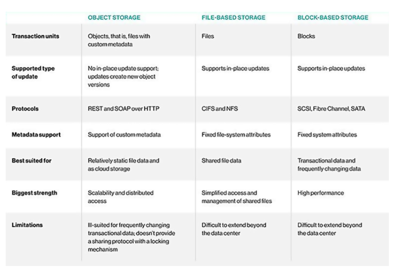

# Block storage & File storage & Object storage
  
  

# AWS S3
 - Amazon Simple Storage Service (Amazon S3) là một dịch vụ lưu trữ đối tượng cung cấp khả năng thay đổi theo quy mô, tính khả dụng dữ liệu, độ bảo mật và hiệu năng hàng  đầu trong ngành. Điều này có nghĩ là khach hàng thuộc mọi quy mô và ngành nghêf đều có thể dungg dịch vụ này để lưu trữ  và bảo vệ bất kỳ dữ liệu nò cho nhiều trường hợp sử dụng như kho dữ liệu, trang web,  ứng dungj di động, sao lưu và khôi phục., lưu trữ, ứng dụng doanh nghiệp, thiết bị IoT và phân tích dữ liệu lớn. Amazon S3 cung cấp các tính năng quản lys dễ sử dụng, nhờ đó bạn có thể tổ chức dữ liệu và cấu hình các biện pháp kiểm soát truy cập được tinh chỉnh để đáp ứng yêu cầu cụ thể của doanh nghiệp, tổ chức và yêu cầu về tuân thủ. Amazon S3 được thiết kế để đảm bảo độ bền 99,999999999 (11 9's) và lưu trữ dữ lệu của hàng triệu ứng dụng cho các công ty trên toàn thế giới (AWS docx)
## Features of Amazon S3
**Storage classes**
 - S3 standard
 - S3 Standard-Infrequent Access (S3 standard-IA)
 - S3 One Zone-Infrequent Access (S3 One Zone - IA)
 - Amazon S3 Glacier (S3 Glacier)
 - Amazon S3 Glacier Deep Archive (S3 Glacier Deep Archive)
 - S3 Intelligent-Tiering
  
**Storage management**: Manage costs, đáp ứng các yêu cầu quy định, giảm độ trễ và tạo nhiều bản sao lưu cho các dữ liệu
 - S3 Lifecycle
 - S3 Object Lock 
 - S3 Replication
 - S3 Batch Operations

**Access management**: Audit và manage access tới bucket và object. Mặc đinh, S3 bucket và object bên trong là private. Chỉ có thể truy cập và S3 resource mà ta tạo ra.
 - S3 Block Public Access
 - AWS Identity and Access Management (IAM)
 - Bucket policies
 - Amazon S3 access points
 - Access control lists (ACLs)
 - S3 Object Ownership 
 - Access Analyzer for S3
  
**Data processing**
 - S3 Object Lambda
 - Event notifications
  
**Storage logging and monitoring**
  - Automated monitoring tools
    - Amazon CloudWatch metrics for Amazon S3 
    - AWS CloudTrail 
  - Manual monitoring tools
    - Server access logging
    - AWS Trusted Advisor
  
**Analytics and insights**
 - Amazon S3 Storage Lens
 - Storage Class Analysis
 - S3 Inventory with Inventory reports 
  
**Strong consistency**

## How Amazon S3 works
  - Dữ liệu trong S3 được lưu trữ dưới dạng các object bên trong các bucket. Bucket chưa object và object là một file và metadata của file đó. 
  - Để cấp quyền truy cập vào các object, có thể sử dụng bucket policy hoặc IAM policy, ACL hoặc S3 access poind (nên sử dụng 2 cái đầu để cấp quyền)

**Bucket**

  - Một bucket là nơi sẽ chứa các object bên trong. Ta có thể lưu trữ rất nhiều object bên trong một bucket và mỗi account có thể có đến 100 bucket (Có thể request AWS dể tăng số lượng)
  - Nếu object name là ```photos/puppy.jpg``` được lưu bên trong bucket name ```DOC-EXAMPLE-BUCKET``` trong US West region thì địa chỉ truy cập của object sẽ là ```https://DOC-EXAMPLE-BUCKET.s3.us-west-2.amazonaws.com/photos/puppy.jpg``` 
  *Lưu ý:* Sau khi tao bucket name thì sẽ không thể thay đổi được tên của bucket. Bucket name phải tuân theo rule sau [bucket naming rule](https://docs.aws.amazon.com/AmazonS3/latest/userguide/bucketnamingrules.html)

**Object**

  - Bao gồm data và metadata.
  - Object được xác định duy nhất bên trong một bucket bởi key (name) và version ID (if S3 Versioning is enabled )

**Keys**

  - Mỗi object trong một bucket có duy nhất 1 key. Sự kết hợp của một bucket, object key và vesion ID (optional) đại diện duy nhất cho mỗi object.

**S3 Versioning**

  - Sử dụng để lưu trữ nhiều version của object bên trong bucket. 
  - S3 versioning: lưu trữ, truy xuất và khôi phục mội version của mọi object lưu trữ bên trong bucket
  - Version ID: khi enable S3 versioning thì  S3 sẽ tạo ra một version ID duy nhất cho mỗi project thêm vào trong bucket. Nếu đã có object trong bucket thì nó sẽ có version ID bằng ```NULL```

**Bucket policy** (size limit 20KB)

  - Một bucket policy là một resource-base policy hoặc Identity-base policy mà được sử dụng để cấp quyền cho bucket và obejct bên trong đó.
  - Chỉ bucket owner mới có thể liên kết policy với nó.
# Tham khảo
- https://vietnix.vn/file-storage-block-storage-va-object-storage-la-gi/#:~:text=File%20storage%20t%E1%BB%95%20ch%E1%BB%A9c%20v%C3%A0,%C4%91%C6%B0%E1%BB%A3c%20li%C3%AAn%20k%E1%BA%BFt%20(metadata).
- https://www.thegioimaychu.vn/blog/tong-hop/uu-va-nhuoc-diem-cua-luu-tru-block-vs-file-vs-object-storage-p7549/
- https://docs.aws.amazon.com/AmazonS3/latest/userguide/Welcome.html
- https://docs.aws.amazon.com/AmazonS3/latest/userguide/Welcome.html#S3Features