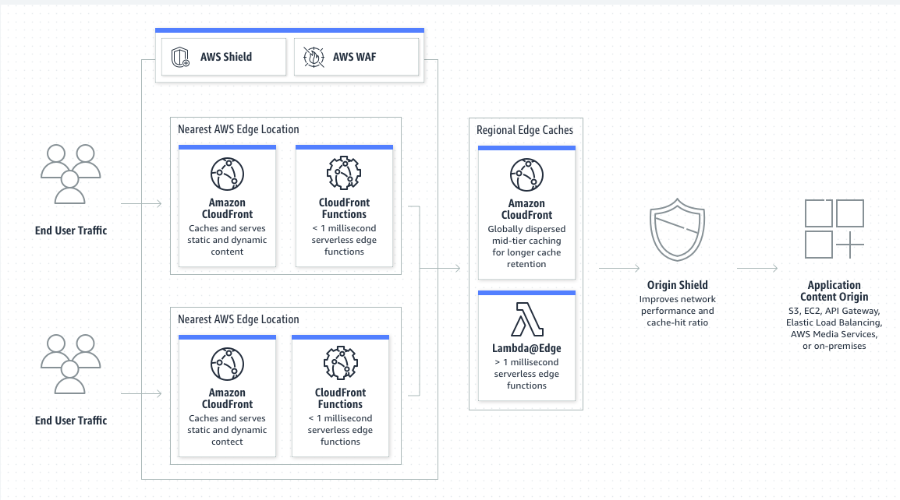
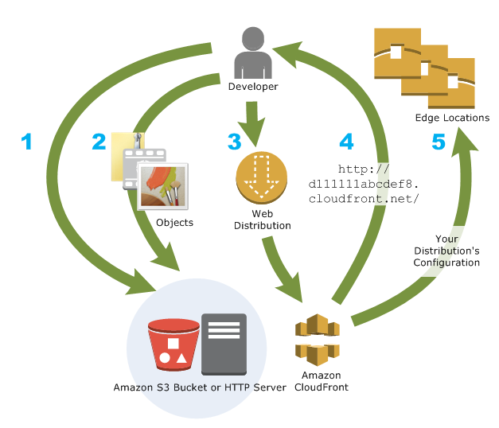
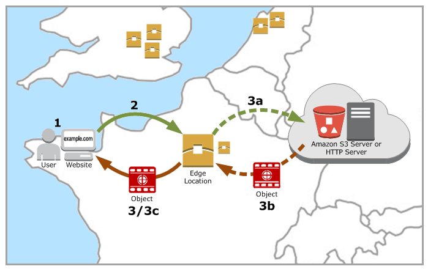

# Khái niệm
- Amazon CloudFront là dịch vụ mạng phân phối nội dung (CDN) được xây dựng với hiệu suất cao, an toàn và thuận tiện cho nhà phát triển.
 

# How you set up CloudFront to deliver content

**How you configure CloudFront to deliver your content**
1. Bạn chỉ định origin server, chẳng hạn như Amazon S3 hay HTTP server của bạn, từ đó Cloudfront nhận các file của bạn và sau đó phân phối từ các Cloudfront edge trên toàn thế giới.   Một origin server lưu trữ phiên bản gốc của các đối tượng của bạn. Nếu bạn đang phân phối nội dung qua HTTP, origin server của bạn có thể là một Amazon S3 bucket hoặc một HTTP server. HTTP server có thể launch trên một EC2 instance hoặc trên server mà bạn quản lý; những server này còn được gọi là custom server.
2. Bạn upload các file lên origin server. Các file của bạn hay các object bao gồm web pages, images, media file hoặc có thể là bất cứ thứ gì được phân phối qua HTTP server.   Nếu bạn sử dụng Amazon S3 bucket là origin server, ban có thể puclic việc đọc các object để bất kỳ ai có Cloudfront URL có thể truy cập chúng. Hoặc bạn cũng có thể giữ object là private và điều khiển việc truy cập. See [Serving private content with signed URLs and signed cookies](https://docs.aws.amazon.com/AmazonCloudFront/latest/DeveloperGuide/PrivateContent.html)
3. Bạn tạo một Cloudfront distribution, nó sẽ cho Cloudfront biết origin server nào để lấy files của bạn khi user yêu cầu truy cập file thông qua web site or application. Đồng thời, bạn chỉ định các chi tiết như bạn có muốn Cloudfront log các request và có muốn enabled các bản phân phối ngay sau khi nó được tạo hay không.
4. Cloudfront chỉ định 1 domain name cho bản phân phối mới mà bạn có thẻ thấy trên console của Cloudfront hoặc domain name đó được phản hồi lại trong một yêu cầu như API request. Nếu muốn bạn có thể thêm tên miền khác để thay thế.
5. Cloudfont gửi các cấu hình của bản phân phối (khong phải nội dung của bạn) tói tất cả các `edge location` hoặc `points of presence (POPs)`- một tập hợp tất cả server trong một data center theo nơi địa lý Cloudfront lưu trữ các bản sao file cỉa bạn

- Khi bạn phát triển website hay application, bạn sử dụng tên miền mà Cloudfront cung cấp cho các URL  của bạn. Ví dụ, nếu cloudfront trả cho bạn 1 domain là `d111111abcdef8.cloudfront.net` làm tên miền cho bản phân phối, URL có `logo.jpg` trong S3 bucket (or root dicrectory của HTTP server) là `http://d111111abcdef8.cloudfront.net/logo.jpg`. Hoặc bạn có thể cấu hình Cloudfront sử dụng domain name riêng của bạn cho bản phân phối như `http://www.example.com/logo.jpg`
- Theo tùy chọn, bạn có thể định cấu hình origin server của mình để thêm header vào tệp, để cho biết thời gian bạn muốn tệp ở trong bộ nhớ cache ở các CloudFront edge locations. Mặc định mỗi file sẽ được lưu trữ ở các edge location 24h trước khi hết hạn. Giá trị tối thiểu là 0s và không có thời gian hết hạn tối đa.
  
# Use cases
## Accelerate static website content delivery
- Cloudfront có thể tăng tốc độ phân phối các nội dung tĩnh (images, video, ....) tới mọi người trên phạm vi toàn cầu. Bạn có thể tận dụng lợi thế của các đường backbonde AWS và các Cloudfront cache server để cung cấp nội dung cho user một cách nhanh chóng, an toàn và trải nghiệm đáng tin cậy khi sử dụng website của bạn.
- Một cách tiếp cận đơn giản để lưu trữ và phân phối nội dung tĩnh là sử dụng Amazon S3 bucket. Việc này mang lại nhiều lợi thế, bao gồm việc sử dụng  Origin Access Identity (OAI) để dễ dàng hạn chế truy cập nội dung trong S3.
- Để biết thêm thông tin về việc sử dụng S3 cùng với CloudFront, bao gồm mẫu AWS CloudFormation để giúp bạn bắt đầu nhanh chóng, [Xem tại đây](https://aws.amazon.com/blogs/networking-and-content-delivery/amazon-s3-amazon-cloudfront-a-match-made-in-the-cloud/)

## Serve video on demand or live streaming video
- Cloudfront cung cấp lựa chọn cho việc phát video trực tuyến theo yêu cầu cho người dùng toàn cầu hoặc cả các sự kiện live.
  - Đối với phát trực tuyến video theo yêu cầu (VOD), Cloudfront hỗ trợ phát trực tuyến ở định dạng MPEG DASH, Apple HLS, Microsoft Smooth Streaming, and CMAF, tới mọi thiết bị
  - Đối với một luồng phát trực tiếp, bạn có thể cache lại media tại edge, so that multiple requests for the manifest file that delivers the fragments in the right order can be combined, to reduce the load on your origin server.
- [Click](https://docs.aws.amazon.com/AmazonCloudFront/latest/DeveloperGuide/on-demand-streaming-video.html) để thêm thông tin chi tiết.

## Encrypt specific fields throughout system processing
- Khi sử dụng HTTPS với Cloudfront, bạn đã có một kết nối an toàn tới origin server. Khi bạn cung cấp thêm field-level encryption, bạn có thể bảo vệ dữ liệu cụ thể trong suốt quá trình xử lý ngoài HTTPS,  để chỉ một số ứng dụng nhất định tại nguồn của bạn mới có thể xem dữ liệu
- Để thiết lập field-level encryption, bạn thêm public key vào CloudFront, sau đó chỉ định tập hợp các fields mà bạn muốn được mã hóa bằng key. [For more information](https://docs.aws.amazon.com/AmazonCloudFront/latest/DeveloperGuide/field-level-encryption.html)

## Customize at the edge
- Việc chạy serverless ở trên các edge server giúp có thể tùy chỉnh nội dung và trải nghiệm cho user, giảm độ trễ. Ví dụ, bạn có thể trả lại một lỗi tùy chỉnh khi origin server tạm ngừng để bảo trì, vì vậy người xem sẽ không nhận được các lỗi chung chung. Hoặc bạn có thể viết một function để giúp cấp quyền và kiểm soát quyền truy cập nội dung, trước khi Cloudfront chuyển tiếp yêu cầu tới origin.
- Sử dụng Lambda@Edge với Cloudfront cho phép nhiều cách khác nhau để tùy chỉnh nội dung mà Cloudfront cung cấp.
- how to create and deploy functions with CloudFront, [see](https://docs.aws.amazon.com/AmazonCloudFront/latest/DeveloperGuide/lambda-at-the-edge.html)
  
## Serve private content by using Lambda@Edge customizations
- Sử dụng Lambda@Edge có thể giúp bạn cấu hình các bản phân phối Cloudfront của mình để phân phát nội dung riêng tư từ custom origin. ngoài việc sử dụng các singed URL hay signed cookie
- Để phân phát nội dung riêng tư bằng CloudFront, bạn làm như sau:
  - Yêu cầu người dùng của bạn (người xem) truy cập nội dung bằng [signed URL hoặc signed cookie](https://docs.aws.amazon.com/AmazonCloudFront/latest/DeveloperGuide/PrivateContent.html).
  - Hạn chế truy cập tới origin, bạn có thể làm như sau:
    - Với Amazon S3 origin, sử dụng [open access identity OAI](https://docs.aws.amazon.com/AmazonCloudFront/latest/DeveloperGuide/private-content-restricting-access-to-s3.html)
    - Với custom origin:
      - Nếu origin được bảo vệ bởi security group hoặc AWS Firewall Manager, bạn có thể sử dụng [Cloudfront managed prefix list](https://docs.aws.amazon.com/AmazonCloudFront/latest/DeveloperGuide/LocationsOfEdgeServers.html#managed-prefix-list) để allow inbound traffic truy cập tới origin chỉ từ IP gốc của Cloudfront.
      - Sử dụng HTTP header để hạn chế quyền truy cập với request từ Cloudfront. see [Restricting access to files on custom origins](https://docs.aws.amazon.com/AmazonCloudFront/latest/DeveloperGuide/private-content-overview.html#forward-custom-headers-restrict-access) and [Adding custom headers to origin requests](https://docs.aws.amazon.com/AmazonCloudFront/latest/DeveloperGuide/add-origin-custom-headers.html). Ví dụ, custom header để [hạn chế truy cập tới ALB](https://docs.aws.amazon.com/AmazonCloudFront/latest/DeveloperGuide/add-origin-custom-headers.html)
      - Nếu custom origin yêu cầu kiểm soát việc truy cập tùy chỉnh, sử dụng Lambda@Edge để implement logic đó. [See](https://docs.aws.amazon.com/AmazonCloudFront/latest/DeveloperGuide/add-origin-custom-headers.html)

# How CloudFront delivers content
- Sau khi setup ban đầu, Cloudfront hoạt động cùng với website or application của bạn và tăng tốc độ phân phối nội dung. Vậy cách mà Cloudfront phân phát nội dung như thế nào khi user request.
  
1. User truy cập website hay application của bạn và gửi request cho một đối tượng (image file or HTML file)
2. DNS route request tới Cloudfont POP (edge location) có thể phục vụ tốt nhất - thường là Cloudfront POP gần nhất về độ trễ và định tuyến request tới nó.l
3. Cloudfront kiểm tra cache của nó cho đối tượng được yêu cầu. Nếu object được cache, Cloudfront sẽ return về cho user. Nếu ojbject không được cache:
   
   a. Cloudfront so sánh request với các thông số kỹ thuật trong bản phân phối và forward request tới origin server cho object tương ứng.  
   b. Origin server sẽ trả lại object cho edge location. 
   c. Ngay sau khi byte đầu tiên nhận được từ origin, Cloudfront bắt đầu forward object tới user. Cloudfront cũng thêm object vào cache cho những lần request sau đó.
# Tham khảo:
https://docs.aws.amazon.com/AmazonCloudFront/latest/DeveloperGuide/IntroductionUseCases.html