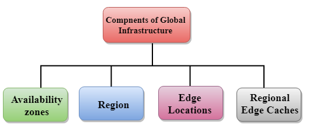
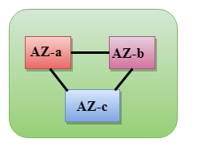

# AWS Global Infrastrucure
- AWS là một nền tảng điện toán đám mây (cloud computing platform) trên phạm vi toàn cầu
- AWS cloud infrastructure được xây dựng ở các Region trên toàn thế giới.
- Theo số liệu năm 2022, AWS đã đưa vào hoạt động khoản 80 AZ với 25 Region trên toàn thế giới.
- The following are the components that make up the AWS infrastructure:

**Avaibility Zone (AZ)**
- Một AZ là một Data Center (DC) có thể ở bất kỳ nơi này trên 1 quốc gia hoặc 1 thành phố. Với mỗi DC, bao gồm nhiều server, networking, LB, firewall, power đảm bảo kết nối dự phòng.
- Mỗi AZ có thể bao gồm 1 hoặc nhiều DC.
- Các AZ tách biệt nhau về mặt địa lý với một khoảng cách đủ ý nghĩa (~100km)
- Tất cả các AZ trong Khu vực AWS được kết nối với mạng băng thông cao, độ trễ thấp, dự phòng trên mức đầy đủ, sử dụng hệ thống cáp sợi metro chuyên dụng, cung cấp kết nối mạng thông lượng cao, độ trễ thấp giữa các AZ
**Region**
- Một Region là một khu vực địa lý, mỗi Region bao gồm 2 hoặc nhiều AZ
- Mỗi Region là một tập hợp các DC mà được tách biệt hoàn toàn với các Region khác
- Mỗi Region bao gồm nhiều hơn 2 AZ connect với nhau thông qua các links có độ trễ thấp
  
**Edge locations**
- Edge locations là một endpoint cho AWS user sử dụng để caching content
- Edge locations là một phần của Cloudfront (CDN)
- Edge locations bao gồm nhiều region. Hiện tại có khoảng 150 Edge locations
- Edge locations hầu hết ở các thành phố lớn để phân phối nội dung đến người dùng cuối với độ trễ giảm.
- Khi user requests data, nếu data không có sẵn ở Edge locations thì nó sẽ lấy từ orgin mà ta define như S3 bucket,..
**Regional Edge Cache**
- Là một tính năng của edge locations ra mắt năm 2016 giúp cải thiện hiệu năng và giảm tải cho tài nguyên của origin
- Regional edge cache nằm giữa cloudfront origin server và edge locations
- Khi user request data, data nếu không có ở edge location thì nó sẽ lấy được từ regional edge localtion thay vì origin server.
# Tham khảo:
- https://www.javatpoint.com/aws-global-infrastructure<!-- slide -->
- https://docs.aws.amazon.com/whitepapers/latest/aws-overview/global-infrastructure.html