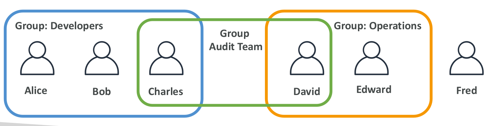
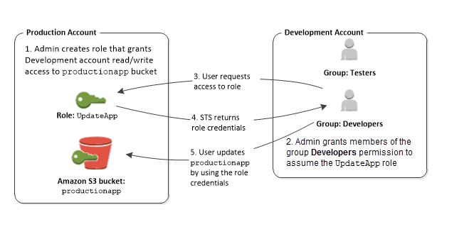
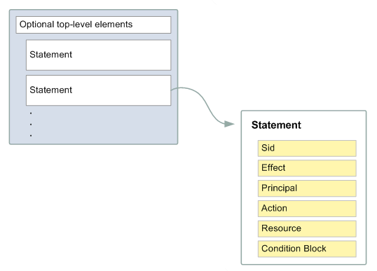

# IAM user & group:
- IAM user là một thực thể mà bạn tạo trên AWS để đại diện cho một người hoặc một ứng dụng mà sử dụng để tương tác với AWS.
- Một user trên AWS bao gồm tên và credentials.
- Một User với quyền administratos thì không giống với AWS root account. Detail, see: [AWS root account](https://docs.aws.amazon.com/IAM/latest/UserGuide/id_root-user.html)
- Groups là một nhóm các user, cho phép chỉ định quyền cho multi user. Điều này giúp quản llý quyền cho những user đó dễ dàng hơn
- Groups chỉ chứa user, không thể chứa groups khác
- Một user có thể không thuộc group nào và cũng có thể thuộc nhiều groups khác nhau
  
*Tham khảo thêm về [user](https://docs.aws.amazon.com/IAM/latest/UserGuide/id_users.html) và [group](https://docs.aws.amazon.com/IAM/latest/UserGuide/id_groups.html)*

# IAM role
- IAM role là một danh tính mà bạn có thể tạo trong aws account với các permission cụ thể. 
- IAM role gần giống với IAM user ở chỗ nó xác định các chính sách quyền mà có thể và không thể làm trong AWS. Tuy nhiên, thay vì liên kết duy nhất với một người, role được dự định sẽ đảm nhận bởi bất kỳ ai cần nó.
- Một Role không có thông tin xác thực như password hoặc access key được liên kết với nó. Thay vào đó khi dảm nhận một role, nó cung cấp thông tin xác thực bảo mật tạm thời cho phiên hiên tại.
- Role có thể được sử dungj để ủy quyền truy cập cho user, application, hoặc service mà k có quyền truy cập vào resource AWS. Ví dụ:
  - Cấp quyền cho user trong AWS account truy cập vào các resource mà họ thường không có, hoặc cấp quyền truy cập cho user trong 1 AWS account này và resource trong account khác.
  - Cấp quyền cho mobile app sử dụng resource nhưng không muốn dùng AWS key trong app.

- [Term and concepts](https://docs.aws.amazon.com/IAM/latest/UserGuide/id_roles_terms-and-concepts.html)
## Providing access to an IAM user in another AWS account that you own
[Tham khảo](https://docs.aws.amazon.com/IAM/latest/UserGuide/id_roles_common-scenarios_aws-accounts.html)
  
## How IAM roles differ from resource-based policies
[Tham khảo](https://docs.aws.amazon.com/IAM/latest/UserGuide/id_roles_compare-resource-policies.html)
# IAM permission & policy
- Bạn quản lý truy cập trên AWS bằng việc tạo policy và gán chúng tới IAM identites(users, groups of user, role) hoặc các AWS resources.
- Một policy là một object trên AWS, khi kết hợp với identity or resource sẽ define ra permission của nó. 
- Policy được lưu trữ dưới dạng JSON document. Hỗ trợ 6 loại policy:
  - ```Identity-based policies```: Gắn managed or inline policy tới IAM identity (user, groups of user, roles).
    - ```Managed policies```: standalone identity-based policies mà bạn có thể attach tới multiple users, groups, và roles trên tài khoản AWS. Có 2 loại managed policies:
      - ```AWS Managed policies```: Created and managed AWS
      - ```Customer managed policies```: bạn tạo và quản lý trong tài khản aws. Bạn có thể cung cấp các policies với quyền tối thiểu khi sử dụng loại này.
    - ```inline policies```: Policies mà ban add trực tiếp cho user, groups, roles và sẽ bị xóa khi xóa identity.
       *[Tham khảo thêm về manage policy và inline policy](https://docs.aws.amazon.com/IAM/latest/UserGuide/access_policies_managed-vs-inline.html)*
  - ```Resource-based policies```: Attach inline policies to resources. Phố biến nhất của loại policy này là Amazon S3 bucket policies và IAM role trust policies. Loại policies này gán quyền cho các pricipal cụ thể để thực hiện các action được chỉ định trên resource. Resource-based policies are inline policies. There are no managed resource-based policies. [Learn more](https://docs.aws.amazon.com/IAM/latest/UserGuide/access_policies.html#policies_resource-based)
  - ```IAM permissions boundaries```: bạn đặt quyền tối đa mà chính sách dựa trên danh tính có thể cấp cho một thực thể IAM. Khi bạn set  permissions boundary cho một thực thể, thì thực thể đó chỉ có thể thực hiện các hành động được cho phép bởi cả identity-based policies và permissions boundaries của nó. [Learn more](https://docs.aws.amazon.com/IAM/latest/UserGuide/access_policies.html#policies_bound)
  - ```Service control policies (SCPs)```: [Tham khảo](https://docs.aws.amazon.com/IAM/latest/UserGuide/access_policies.html#policies_scp)
  - ```Access control lists (ACLs)```: [Tham khảo](https://docs.aws.amazon.com/IAM/latest/UserGuide/access_policies.html#policies_acl)
  - ```Session policies```: [Tham khảo](https://docs.aws.amazon.com/IAM/latest/UserGuide/access_policies.html#policies_session)
  
**<ins>Lưu ý</ins>**
  - AWS account root có thể bị ảnh hưởng bời một số loại policies còn loại khác thì không. Ví dụ: không thể attach Identity-based policies tới root user, tuy nhiên có thể chỉ định root user như một principal trong Resource-based policies. A root user is still the member of an account. If that account is a member of an organization in AWS Organizations, the root user is affected by any SCPs for the account.

# JSON policy document structure
- Một JSON policy document bao gồm:
  

  - Mỗi một statement bao gồm một permission duy nhất. Nếu một policy bao gồm nhiều statements, AWS sẽ áp dụng toán tử ```OR``` cho các statement.

*Ví dụ*
```
{
   "Version":"2012-10-17",
   "Statement":[
      {
         "Effect":"Allow",
         "Action":"ec2:Describe*",
         "Resource":"*"
      },
      {
         "Effect":"Allow",
         "Action":"elasticloadbalancing:Describe*",
         "Resource":"*"
      },
      {
         "Effect":"Allow",
         "Action":[
            "cloudwatch:ListMetrics",
            "cloudwatch:GetMetricStatistics",
            "cloudwatch:Describe*"
         ],
         "Resource":"*"
      }
   ]
}
```

 - ```Version```: Định nghĩa version của policy language mà bạn muốn sử dụng. As a best practice, use the latest 2012-10-17 version.
 - ```Statement```: Main policy element để chứa các element sau. Có thể bao gồm 1 or nhiều statement trong 1 policy
 - ```Sid```(Optional): phân biệt giữa các statement
 - ```Effect```: Sử dụng ```Allow``` or ```Deny``` để chỉ ra hành động cho phép hay từ chối
 - ```Principal``` (Required in only some circumstances): Nếu sử dụng resource-based policy, cần phải chỉ định account, user, role or federated user mà bạn muốn cho phép hay từ chối. IAM policy không thể chứ element này.
 - ```Action```: Danh sách các action mà policy allow hay deny.
 - ```Resource``` (Required in only some circumstances): Với IAM polcy, càn chỉ định một danh sách các resource cụ thể đẻ áp dụng cho action. Với resource-based policy, element này là optional. Nếu không có thì resource mà acction apply là resource mà policy attach.
 - ```Condition```(Optional): Specify the circumstances under which the policy grants permission.

# Multiple statements and multiple policies

```
{
  "Version": "2012-10-17",
  "Statement": [
    {
      "Sid": "FirstStatement",
      "Effect": "Allow",
      "Action": ["iam:ChangePassword"],
      "Resource": "*"
    },
    {
      "Sid": "SecondStatement",
      "Effect": "Allow",
      "Action": "s3:ListAllMyBuckets",
      "Resource": "*"
    },
    {
      "Sid": "ThirdStatement",
      "Effect": "Allow",
      "Action": [
        "s3:List*",
        "s3:Get*"
      ],
      "Resource": [
        "arn:aws:s3:::confidential-data",
        "arn:aws:s3:::confidential-data/*"
      ],
      "Condition": {"Bool": {"aws:MultiFactorAuthPresent": "true"}}
    }
  ]
}
```
- Ở policy trên có 3 statement , mỗi statement định nghĩa một tập hợp các permission riêng biệt trong một tài khoản.
  - ```FirstStatement```:  Cho phép user được phép thay đổi password. ```Resource: "*"``` có nghĩa là all resource nhưng việc changepassword chỉ ảnh hướng tới user yêu cầu.
  - ```SecondStatement```: Cho phép user được quyền list tất cả các bucket trong account. Mặc dù ```Resource: "*"``` nhưng policy không cấp quyền truy cập vào các resource khác nên user chỉ có thể list bucket trong account của họ.
  - ```ThirdStatement```: Cho phép user được quyền list và get bất kỳ object nào bên trong bucket ```confidential-data``` nhưng chỉ áp dụng cho các user được xác thực bằng MFA.
  
 *Khi một policy statement chứa một ```condition``` thì các permission chỉ thực thi khi điều kiện trong ```condition``` trả về ```true```*
# Tham khảo:
- https://docs.aws.amazon.com/IAM/latest/UserGuide/access_policies_managed-vs-inline.html
- https://docs.aws.amazon.com/IAM/latest/UserGuide/id_roles_create.html
- https://docs.aws.amazon.com/IAM/latest/UserGuide/id_roles_use.html
- https://docs.aws.amazon.com/IAM/latest/UserGuide/id_roles_manage.html